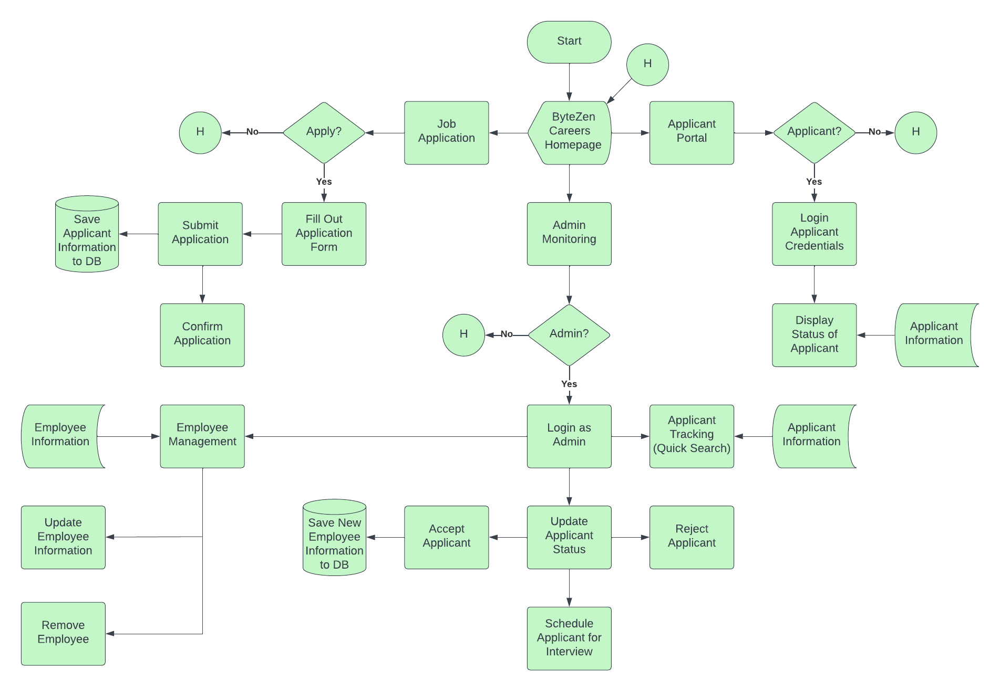

# ByteZen Careers Website

**ByteZen Careers Website** is a streamlined platform that bridges the gap between job seekers and employers. It simplifies the job application experience for applicants and provides efficient tracking and management tools for recruiters and administrators.



## 🚀 Features

### For Applicants
- 🔍 **Browse Jobs** — View available job positions on the home page.
- 📄 **Submit Applications** — Apply directly to job openings and upload resumes.
- 👁 **Track Application Status** — Enter your name and email to check application progress.
- ✅ **Confirmation Page** — Receive a visual confirmation once your application is submitted.

### For Admins
- 🔐 **Secure Admin Login** — Basic login for administrator access.
- 📋 **Applicant Management** — View all applications submitted, including uploaded resumes.
- 🛠 **Status Updates** — Update the status of applications (e.g., under review, accepted, rejected).
- 📊 **Monitoring Dashboard** — See how many applicants are associated with each job position.

## 🛠 Tech Stack

- **Backend:** Python, Flask
- **Frontend:** HTML, CSS, JavaScript
- **Database:** SQLite
- **Package Management:** Poetry
- **File Storage:** Local resume uploads (PDF)
- **Deployment:** Compatible with Replit and local servers

## 📂 Project Structure

```
bytezen-careers-website/
├── app.py                  # Main Flask app
├── database.py             # SQLite database connection
├── file_saver.py           # File upload and storage handling
├── status_update.py        # Application status update logic
├── templates/              # HTML templates
├── static/                 # CSS, logos, and resumes
├── .env                    # Environment variables
├── requirements.txt
├── pyproject.toml          # Poetry config
└── ProjectFlowchart.png    # System flowchart
```

## 🧪 Setup Instructions

Follow these steps to set up and run the project in your local environment:

1. **Clone the Repository**

   ```bash
   git clone https://github.com/jayelcee/bytezen-careers-website.git
   cd bytezen-careers-website
   ```

2. **Create a Virtual Environment**

   ```bash
   python3 -m venv venv
   ```

3. **Activate the Virtual Environment**

   ```bash
   source venv/bin/activate
   ```

4. **Install Dependencies**

   ```bash
   pip install -r requirements.txt
   ```

5. **Run the Flask Application**

   ```bash
   python3 app.py
   ```

6. **Access the Website**

   Open your browser and go to:  
   [http://localhost:5000](http://localhost:5000)

## 🔑 Admin Login (for Demo)

> This is a simplified system without a user database. Admin credentials are hardcoded in `app.py`.

```text
Username: admin
Password: admin123
```

## 📁 Resume Uploads

Uploaded resumes are stored in:

```
static/resume/
```

Applicants can upload PDFs only.

## ⚙️ Functional Highlights

- Modular Flask app using route-based views.
- Simple form-based submission for job seekers.
- Local file handling for storing resumes.
- SQLite-powered job and applicant tracking.

## 📜 License

This project is licensed under the [MIT License](LICENSE).

## 🙌 Acknowledgements

Built with ❤️ to demonstrate how Flask can power basic job tracking systems. Inspired by real-world HR tools with a minimalist touch for easy setup and testing.
